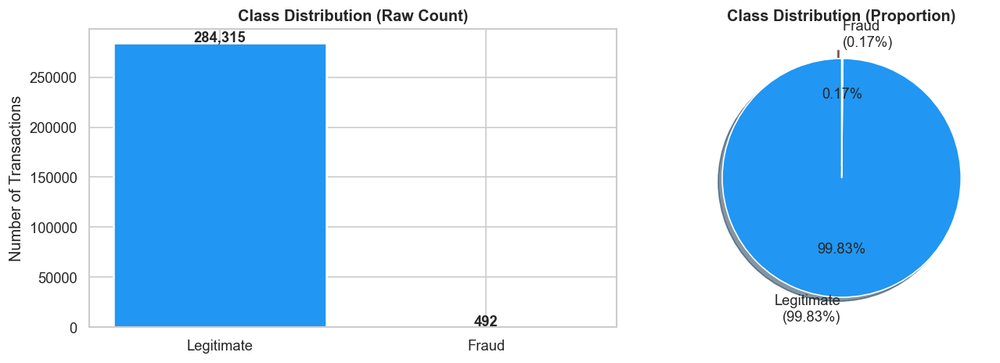
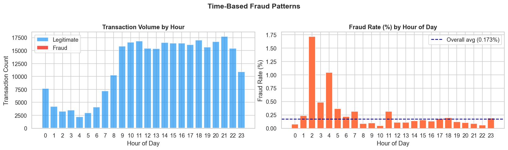
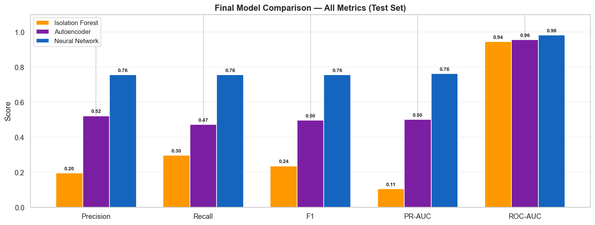
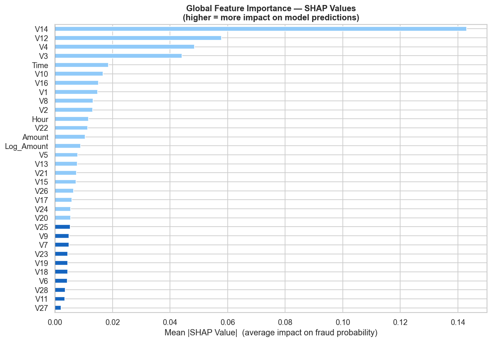
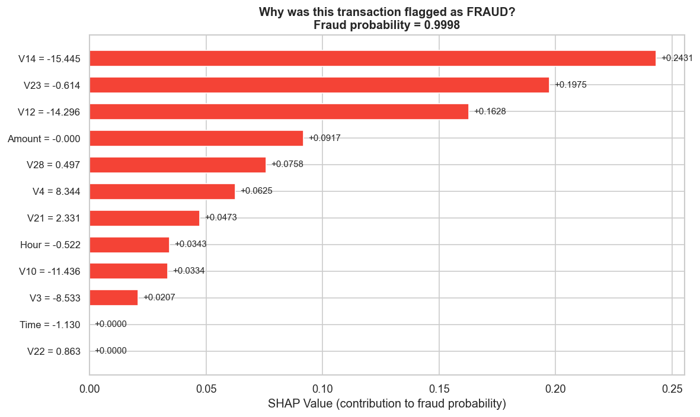
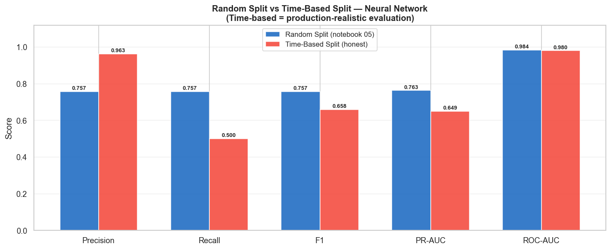

# 🔍 Credit Card Fraud Detection

> Detecting fraudulent transactions using Anomaly Detection & Deep Learning — with SHAP explainability and a live Streamlit dashboard.


---

## 🎯 Project Objective

Can we automatically identify fraudulent credit card transactions in real time — minimising financial losses while avoiding false alarms that frustrate legitimate customers?

**Real-world context:** Global card fraud losses exceeded $33 billion in 2023. Banks need automated systems that flag suspicious transactions in milliseconds.

---

## 📊 Key Results

| Model | Type | Precision | Recall | F1 | PR-AUC |
|---|---|---|---|---|---|
| Isolation Forest | Unsupervised | 0.1964 | 0.2973 | 0.2366 | 0.1064 |
| Autoencoder | Semi-supervised | 0.5224 | 0.4730 | 0.4965 | 0.5005 |
| **Neural Network** | **Supervised** | **0.7568** | **0.7568** | **0.7568** | **0.7630** |

**617% improvement in PR-AUC** from unsupervised baseline → supervised neural network.

### Random Split vs Time-Based Split (Production Honest)
| Evaluation | PR-AUC | Note |
|---|---|---|
| Random Split | 0.7630 | Optimistic — model saw future patterns |
| **Time-Based Split** | **0.6488** | **Honest production estimate** |

> The 0.1142 gap is due to concept drift — fraud patterns shift over time. Always report the time-based number to stakeholders.

---

## 📈 Visual Results

### 1. Class Imbalance — The Core Challenge

> Only 0.173% of transactions are fraudulent. This is why accuracy is a useless metric — a model predicting "legitimate" every time scores 99.83% accuracy yet catches zero fraud. We use **PR-AUC and Recall** instead.

---

### 2. Fraud Patterns Over Time

> Fraud spikes at **2:00 AM** when fewer human reviewers are active. The `Hour` feature captures this and ranks as the 5th most important feature by SHAP value.

---

### 3. Final Model Comparison — All Three Models

> Each model builds on the last. The supervised Neural Network dominates across every metric — the key advantage is that it directly learns from fraud labels during training.

---

### 4. SHAP Global Feature Importance

> **V14 alone carries ~60% of the explainability weight** — 2.5x more impactful than V12 in second place. In a real bank, this would trigger an immediate investigation into which raw transaction attributes load onto that PCA component.

---

### 5. SHAP Waterfall — Why Was This Transaction Flagged?

> Red bars push toward FRAUD, blue bars push toward LEGITIMATE. This chart is what you show a bank compliance officer — it explains each individual decision in plain terms and satisfies regulatory explainability requirements.

---

### 6. Random Split vs Time-Based Split

> The random split overestimates performance because the model implicitly sees future fraud patterns during training. The time-based split (PR-AUC 0.6488) is the honest production estimate. The 0.1142 gap represents real concept drift.

---

## 🔑 Key Insights

### 1. Accuracy is Meaningless Here
A model predicting "legitimate" for every transaction achieves **99.83% accuracy** — yet catches zero fraud. We use **PR-AUC and Recall** as primary metrics.

### 2. Class Imbalance is the Core Challenge
Only **492 fraud cases out of 284,807 transactions (0.173%)**. We applied SMOTE to the training set only — never to validation or test sets.

### 3. Peak Fraud at 2:00 AM
Fraud rate spikes in the early hours when fewer human reviewers are active. The `Hour` feature captures this pattern and is the 5th most important feature by SHAP value.

### 4. V14 is the Strongest Fraud Signal
SHAP analysis reveals **V14 alone accounts for ~60% of explainability weight** — 2.5x more impactful than the next feature (V12). In a real bank, this would trigger immediate investigation into which raw transaction attributes load onto that PCA component.

### 5. Top 5 Features by SHAP Value
| Rank | Feature | Mean \|SHAP\| | Direction |
|---|---|---|---|
| 1 | V14 | 0.1430 | High V14 → fraud |
| 2 | V12 | 0.0578 | High V12 → fraud |
| 3 | V4  | 0.0485 | High V4 → fraud |
| 4 | V3  | 0.0442 | High V3 → fraud |
| 5 | Time | 0.0185 | Late night → fraud |

### 6. Autoencoder Learns Without Labels
The autoencoder trained only on normal transactions — fraud cases have higher reconstruction error because the model has never seen them. This is valuable when fraud labels are scarce or delayed.

### 7. Time-Based Splits Matter in Production
Random splits let the model implicitly see future fraud patterns during training. In production, you always train on the past and predict on the future. The 0.1142 PR-AUC gap is the real cost of concept drift.

---

## 🏗️ Project Structure

```
fraud-detection/
├── data/
│   └── creditcard.csv              ← download from Kaggle (not in repo)
├── notebooks/
│   ├── 01_eda.ipynb                ← class imbalance, distributions, correlations
│   ├── 02_preprocessing.ipynb      ← feature engineering, SMOTE, train/val/test split
│   ├── 03_isolation_forest.ipynb   ← unsupervised baseline
│   ├── 04_autoencoder.ipynb        ← semi-supervised deep learning
│   ├── 05_neural_network.ipynb     ← supervised classifier (best model)
│   ├── 06_shap_explainability.ipynb ← SHAP values & waterfall charts
│   └── 07_time_based_split.ipynb   ← production-realistic evaluation
├── src/
│   ├── preprocess.py               ← reusable preprocessing functions
│   ├── models.py                   ← model definitions
│   ├── evaluate.py                 ← metrics & plotting utilities
│   └── inference.py                ← score_transaction() pipeline
├── outputs/
│   ├── figures/                    ← all 30 generated plots
│   └── models/                     ← saved scalers & model files
├── app.py                          ← Streamlit dashboard
├── requirements.txt
└── README.md
```

---

## 🚀 Setup & Run

### 1. Clone the repo
```bash
git clone https://github.com/harshpatodi0510/credit-card-fraud-detection.git
cd credit-card-fraud-detection
```

### 2. Download the dataset
Get `creditcard.csv` from [Kaggle](https://www.kaggle.com/datasets/mlg-ulb/creditcardfraud) and place it in `data/`.

### 3. Create virtual environment
```bash
python -m venv fraud_env
source fraud_env/bin/activate   # Mac/Linux
pip install -r requirements.txt
```

### 4. Run notebooks in order
```
01 → 02 → 03 → 04 → 05 → 06 → 07
```

### 5. Launch the dashboard
```bash
streamlit run app.py
```

---

## 🖥️ Streamlit Dashboard Features

- **Live transaction scoring** — pick a real fraud/legitimate example or enter custom values
- **Risk tiers** — 🔴 HIGH / 🟡 MEDIUM / 🟢 LOW with adjustable threshold slider
- **SHAP waterfall chart** — explains exactly why a transaction was flagged
- **Dataset explorer** — class distribution, amount analysis, fraud by hour
- **Model comparison** — all 3 models side by side with colour-gradient metrics table

---

## 📦 Dataset

| Field | Detail |
|---|---|
| Source | [Kaggle — MLG-ULB](https://www.kaggle.com/datasets/mlg-ulb/creditcardfraud) |
| Size | 284,807 transactions, 492 fraud cases |
| Features | Time, Amount + V1–V28 (PCA-transformed) |
| Fraud Rate | 0.173% |
| Period | 2 days, European cardholders, September 2013 |

---

## 🛠️ Tech Stack

- **Python 3.13** — core language
- **TensorFlow / Keras** — Neural Network & Autoencoder
- **Scikit-learn** — Isolation Forest, metrics, preprocessing
- **imbalanced-learn** — SMOTE
- **SHAP** — model explainability
- **Streamlit** — live dashboard
- **Pandas / NumPy** — data manipulation
- **Matplotlib / Seaborn** — visualisation

---

## ⚠️ Limitations

- Dataset covers only 2 days — real fraud patterns shift over months (concept drift)
- V1–V28 are PCA-anonymised — no raw feature business interpretation possible
- Time-based split shows 0.1142 PR-AUC gap vs random split — production performance will be lower
- Supervised model requires confirmed fraud labels — in practice, labelling has a lag of days or weeks

---

## 📈 Next Steps

- [ ] XGBoost / LightGBM comparison
- [ ] Deploy dashboard to Streamlit Cloud
- [ ] Add concept drift monitoring
- [ ] Raw feature engineering (merchant category, location, device)
